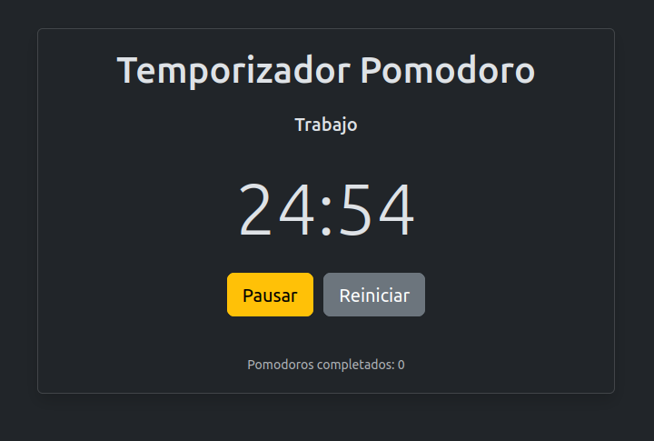

# 🍅 JS Pomodoro Timer

[](https://github.com/soyunomas/js-pomodoro-timer/blob/main/LICENSE)
[](https://soyunomas.github.io/js-pomodoro-timer/index.html)

Una sencilla pero funcional aplicación web de temporizador Pomodoro construida con HTML, Vanilla JavaScript y Bootstrap 5. ¡Ideal para gestionar tu tiempo de trabajo y descanso!  Productivity++

## ✨ Características Principales

*   **⏱️ Temporizador Pomodoro:** Ciclos de trabajo estándar de 25 minutos.
*   **☕ Descansos Programados:** Descansos cortos de 5 minutos y descansos largos de 15 minutos después de cada 4 pomodoros.
*   **⏯️ Controles Intuitivos:** Botones para Iniciar, Pausar, Reanudar y Reiniciar el temporizador.
*   **📊 Contador de Pomodoros:** Lleva la cuenta de cuántos ciclos de trabajo has completado.
*   **🔔 Alertas Sonoras:** Recibe una notificación sonora (¡asegúrate de tener el archivo `alert.mp3`!) cuando termina un intervalo. El sonido se detiene cuando interactúas con los controles.
*   **☀️/🌙 Tema Claro/Oscuro:** Cambia entre un tema claro y oscuro según tu preferencia. ¡Tu elección se guarda en el navegador!
*   **📱 Diseño Responsivo:** Se adapta a diferentes tamaños de pantalla gracias a Bootstrap.
*   **👀 Indicador de Estado:** Muestra claramente si estás en un ciclo de Trabajo, Descanso Corto o Descanso Largo.
*   **✏️ Título Dinámico:** El título de la pestaña del navegador muestra el tiempo restante y el estado actual.

## 🖼️ Captura de Pantalla


*(Asegúrate de que el archivo `screenshot.png` esté en la raíz de tu repositorio)*

## 🚀 Demo en Vivo

Puedes probar la aplicación directamente aquí:
**[👉 Ver Demo en Vivo 👈](https://soyunomas.github.io/js-pomodoro-timer/index.html)**

## 🛠️ Tecnologías Utilizadas

*   🌐 **HTML5:** Estructura semántica del contenido.
*   🎨 **CSS3:** Estilos personalizados mínimos y el poder de...
*   🅱️ **Bootstrap 5.3.3:** Framework CSS para diseño responsivo y componentes UI.
*   <0xF0><0x9F><0x9B><0xAE>️ **Bootstrap Icons 1.11.3:** Iconos para el cambio de tema.
*   🍦 **Vanilla JavaScript (ES6+):** Toda la lógica del temporizador, manejo de estado, manipulación del DOM y control de audio.
*   💾 **LocalStorage API:** Para guardar la preferencia del tema del usuario.
*   🔊 **Web Audio API (`new Audio()`):** Para reproducir las alertas sonoras.

## ⚙️ Cómo Usar Localmente

1.  **Clona el repositorio:**
    ```bash
    git clone https://github.com/soyunomas/js-pomodoro-timer.git
    ```
2.  **Navega al directorio:**
    ```bash
    cd js-pomodoro-timer
    ```
3.  **IMPORTANTE - Archivo de Sonido:**
    *   Consigue un archivo de sonido para las alertas (por ejemplo, un MP3 corto).
    *   Renómbralo a `alert.mp3`.
    *   Coloca el archivo `alert.mp3` en la misma carpeta que `index.html`.
    *   *Sin este archivo, las alertas sonoras no funcionarán (aunque la aplicación no se romperá gracias al manejo de errores).*
4.  **Abre el archivo `index.html`** en tu navegador web preferido.

¡Y listo! Ya puedes empezar a usar tu temporizador Pomodoro.

## 📄 Licencia

Este proyecto está bajo la Licencia MIT. Consulta el archivo [LICENSE](https://github.com/soyunomas/js-pomodoro-timer/blob/main/LICENSE) para más detalles. *(Asegúrate de añadir un archivo LICENSE a tu repositorio, por ejemplo, uno estándar de MIT)*.
